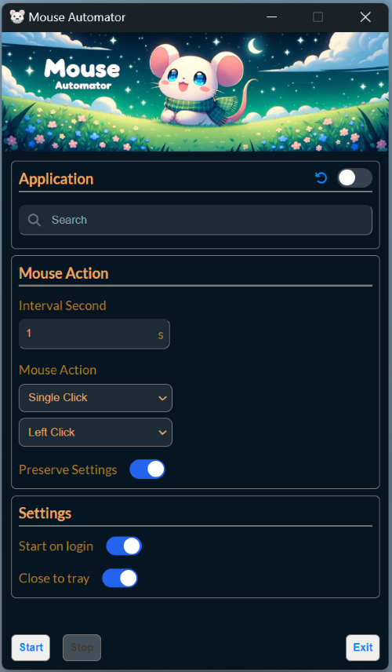

# 🖱️ Mouse Automator

**Mouse Automator** is a lightweight, user-friendly desktop application designed to automate mouse clicks with ease. Whether you're gaming, testing software, or handling repetitive tasks, Mouse Automator has you covered!

### Platform
Supports: **Mac🍎**, **Windows🪟**, **Linux🐧***

*Linux version is not yet tested. Not all desktop environment support is expected. Voluntary testing & issues openings are welcomed* 😁

## 🛠️ How It's Made

This application is built with:

- **[Electron](https://www.electronjs.org/)**: For creating a cross-platform desktop application.
- **[TypeScript](https://www.typescriptlang.org/) + [React.js](https://react.dev/)**: For a strongly-typed, component-based frontend experience.
- **[TailwindCSS](https://tailwindcss.com/)**: For sleek and responsive UI design.
- **[Vite](https://vitejs.dev/)**: For a fast and efficient development environment.
- **[ps-list](https://www.npmjs.com/package/@trufflesuite/ps-list)**: For fetching and managing processes running on your system.
- **[@meadowsjared/robotjs](https://www.npmjs.com/package/@meadowsjared/robotjs)**: For simulating mouse clicks and keyboard inputs.

## ✨ Features

### 🎯 Application Selection
- Quickly search and select the target applications for automated clicks as long as they are running.

### 🔧 Mouse Action Configuration
- **Interval Settings**: Set the time interval between each click (in seconds).
- **Mouse Action**: Choose from a range of click types:
  - **🖱️ Single Click** or **🔁 Double Click**
  - **🔵 Left Click**, **🟡 Middle Click**, or **🔴 Right Click**
- **Preserve Settings**: Save and automatically reload your configurations.

### ⚙️ General Settings
- **🚀 Start on Login**: Run the application automatically when your system starts.
- **🗂️ Close to Tray**: Minimize the application to the system tray for easy access.

### 🕹️ Control Panel
- **▶️ Start / ⏹️ Stop**: Begin or end the automated clicking process with a single click.
- **❌ Exit**: Close the application, with an option to minimize it to the tray.

### 💻 System Integrations
- **📤 System tray**: Runs in system tray and control with a single click in context menu.
- **🎐 Native system notifications**: Get OS native notifications when controlled through system tray

## 🚀 Getting Started

1. **Select Your Target Application**: Use the search bar to find the application you want to target.
2. **Configure Your Mouse Actions**: Set the click interval, type, and other preferences.
3. **Tweak General Settings**: Customize options like startup behavior and tray minimization.
4. **Start Clicking!**: Hit the "Start" button to begin automation and "Stop" to end it.
5. **Exit**: Choose to fully close the application or minimize it to the tray for later use.

## 📥 Installation

1. Select and download the latest version of Mouse Automator of desired platform from the [releases page](https://github.com/cch01/mouse-automator/releases).
2. Run the installer and follow the prompts. **(For Windows)**
3. Launch the app and start automating your mouse clicks!

## 💡 Tips & Tricks

- Use the **Preserve Settings** option to quickly reuse your preferred configurations.
- The **Close to Tray** feature is great for keeping the app running without cluttering your taskbar.

## 🛣️Feature Roadmap

1. 💀 Auto Kill Application
2. ⌨️ Hotkey Activation
3. 🛑 Stop After `timer | count of clicks | until stopped`
4. 🌠 Click at desired screen coordinates
5. 🗃️ Multiple Profiles save/load
6. 🌟 Click Feedback
7. 🤖 Advanced Macro Editor (Action Timeline, Action Editor)

## 📄 License

This project is licensed under the MIT License. See the [LICENSE.md](LICENSE.md) file for more details.

---

Feel free to contribute, share your thoughts, or report issues. Happy automating! 😄
